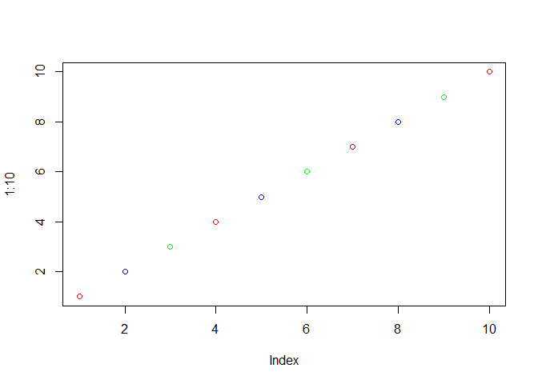

Lecture 7
================
Christina Liem
10/23/2019

# Revisit out functions from last day

``` r
source("http://tinyurl.com/rescale-R")
```

Lets try our rescale() function from the last day

``` r
rescale(1:10)
```

    ##  [1] 0.0000000 0.1111111 0.2222222 0.3333333 0.4444444 0.5555556 0.6666667
    ##  [8] 0.7777778 0.8888889 1.0000000

``` r
rescale(c(3, 10, NA, 7))
```

    ## [1] 0.0000000 1.0000000        NA 0.5714286

What if you add string?

\#is.numeric() means is the input for function x is a number “\!” flips
TRUE/FALSE

``` r
is.numeric(5)
```

    ## [1] TRUE

``` r
!is.numeric(5)
```

    ## [1] FALSE

\#Should we start like this? both\_na \<- function(x,y) { \#something
goes here? } No\! Always start with a simple definiteion of the problem
\#Define an example of x and y Tip: Search for existing functionality to
get started

Search internet for R functions that find NA elements

\#\#Write a function for both\_na()

``` r
#from stackoverflow

x <- c( 1, 2, NA, 3, NA) 
y <- c(NA, 3, NA, 3,  4)
is.na(x)
```

    ## [1] FALSE FALSE  TRUE FALSE  TRUE

``` r
is.na(y)
```

    ## [1]  TRUE FALSE  TRUE FALSE FALSE

``` r
which( is.na(x))
```

    ## [1] 3 5

\#which(is.na(x)) tells you which data point is TRUE working snippet of
code

``` r
is.na(x) & is.na(y)
```

    ## [1] FALSE FALSE  TRUE FALSE FALSE

# & means AND

``` r
c(T,F,T)
```

    ## [1]  TRUE FALSE  TRUE

``` r
both_na <- function(x,y) {
  sum(is.na(x) & is.na(y))
}
```

``` r
both_na(x,y)
```

    ## [1] 1

\#you need to use the sum()

``` r
x <-  c(NA, NA, NA) 
y1 <- c( 1, NA, NA) 
y2 <- c( 1, NA, NA, NA)

both_na(x,y1)
```

    ## [1] 2

``` r
x <-  c(NA, NA, NA) 
y1 <- c( 1, NA, NA) 
y2 <- c( 1, NA, NA, NA)

both_na(x,y1)
```

    ## [1] 2

``` r
x <-  c(NA, NA, NA) 
y1 <- c( 1, NA, NA) 
y2 <- c( 1, NA, NA, NA)

both_na(x, y2)
```

    ## Warning in is.na(x) & is.na(y): longer object length is not a multiple of
    ## shorter object length

    ## [1] 3

``` r
x <-  c(NA, NA, NA) 
y1 <- c( 1, NA, NA) 
y2 <- c( 1, NA, NA, NA)
y3 <- c(1, NA, NA, NA, NA, NA, NA)

both_na(x, y3)
```

    ## Warning in is.na(x) & is.na(y): longer object length is not a multiple of
    ## shorter object length

    ## [1] 6

``` r
plot(1:10, col="red")
```

<!-- -->

``` r
plot(1:10, col=c("red", "blue", "green"))
```

<!-- -->

# “==” is something equal

“\!=” means not equal

``` r
both_na <- function(x,y) {
  if(length(x) != length(y)) {
    stop("Input vectors should be the same lenght")
  }
  sum(is.na(x) & is.na(y))
}
```

\#refine and polish

both\_na3 \<- function(x, y) { if(length(x) \!= length(y)) {  
stop(“Input x and y should be vectors of the same length”) }  
na.in.both \<- ( is.na(x) & is.na(y) )  
na.number \<- sum(na.in.both)  
na.which \<- which(na.in.both) message(“Found”, na.number, " NA’s at
position(s):“, paste(na.which, collapse=”, ") ) return(
list(number=na.number, which=na.which) ) }

\#How to build a grade() function

``` r
#student1
s1 <- c(100, 100, 100, 100, 100, 100, 100, 90) 

#student2
s2 <- c(100, NA, 90, 90, 90, 90, 97, 80)
```

Steps: -find the min value Search for a function that will help you find
the smallest value in a vector

``` r
#student1
s1 <- c(100, 100, 100, 100, 100, 100, 100, 90) 

#student2
s2 <- c(100, NA, 90, 90, 90, 90, 97, 80)

which.min(s1)
```

    ## [1] 8

\-exclude it from the average calculation

``` r
#student1
s1 <- c(100, 100, 100, 100, 100, 100, 100, 90) 

#student2
s2 <- c(100, NA, 90, 90, 90, 90, 97, 80)

s1[which.min(s1)]
```

    ## [1] 90

``` r
#student1
s1 <- c(100, 100, 100, 100, 100, 100, 100, 90) 

#student2
s2 <- c(100, NA, 90, 90, 90, 90, 97, 80)

s1[-which.min(s1)]
```

    ## [1] 100 100 100 100 100 100 100

Adding the “-” index will remove the lowest score in this function and
call the other scores

``` r
mean(s1[-which.min(s1)])
```

    ## [1] 100

For student 2

``` r
mean(s2[-which.min(s2)], na.rm=TRUE)
```

    ## [1] 92.83333

Although this calculates the mean and drops the lowest score, it
wouldn’t work for a student who was missing the hw

``` r
s3 <- c(100, NA, NA, NA, NA)
mean(s3[-which.min(s3)], na.rm=TRUE)
```

    ## [1] NaN

``` r
x <- s2
sum(x[-which.min(x)], na.rm=TRUE) #Total minus the worst
```

    ## [1] 557

``` r
x <- s2
sum(x[-which.min(x)], na.rm=TRUE) #Total minus the worst
```

    ## [1] 557

``` r
#average score
sum(x[-which.min(x)], na.rm=TRUE) / (length(x) - 1)
```

    ## [1] 79.57143

``` r
grade <- function(x) {
  
sum(x[-which.min(x)], na.rm=TRUE) / (length(x) - 1)
}
```

``` r
grade(s1)
```

    ## [1] 100

``` r
grade(s2)
```

    ## [1] 79.57143

``` r
grade(s3)
```

    ## [1] 0

\#Installing
