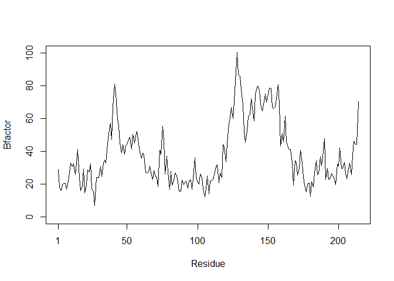

Class 6 R functions
================
Christina Liem
10/18/2019

# This is a H1

This is my class 6 work. This will be **bold**

## A H2

### A level 3 Heading H3

``` r
read.table("test1.txt", sep=",", header = TRUE)
```

    ##   Col1 Col2 Col3
    ## 1    1    2    3
    ## 2    4    5    6
    ## 3    7    8    9
    ## 4    a    b    c

``` r
read.table("test2.txt", sep="$", header = TRUE)
```

    ##   Col1 Col2 Col3
    ## 1    1    2    3
    ## 2    4    5    6
    ## 3    7    8    9
    ## 4    a    b    c

``` r
read.table("test3.txt")
```

    ##   V1 V2 V3
    ## 1  1  6  a
    ## 2  2  7  b
    ## 3  3  8  c
    ## 4  4  9  d
    ## 5  5 10  e

Our first silly function

``` r
add <- function(x, y=1) {      
  # Sum the input x and y    
  x + y 
} 
```

``` r
add(5, 5)
```

    ## [1] 10

``` r
add( x =c(5, 6, 1, 5, 10), y =100)
```

    ## [1] 105 106 101 105 110

``` r
add(c(5, 5, NA, 7))
```

    ## [1]  6  6 NA  8

``` r
x <- range (c(5,2,7,10))
x[1] # min value
```

    ## [1] 2

``` r
x[2] # max value
```

    ## [1] 10

A second function

``` r
rescale <- function(x) {   
  rng <-range(x)   
  (x - rng[1]) / (rng[2] - rng[1]) } 
```

``` r
rescale ( c(1, 2, NA, 5))
```

    ## [1] NA NA NA NA

``` r
x <- c(1, 2, NA, 5)
range(x)
```

    ## [1] NA NA

``` r
rescale2 <- function(x) {
  rng <-range(x, na,rm=TRUE)
  (x - rng[1]) / (rng[2] - rng[1]) 
}
```

``` r
rescale3 <- function(x, na.rm=TRUE, plot=FALSE){   
  if(na.rm) {    
  rng <-range(x, na.rm=TRUE)   
  } else {     
    rng <-range(x)   
  }   
  print("Hello")   
  
  answer <- (x - rng[1]) / (rng[2] - rng[1])   
  return(answer)   
  print("is it me you are looking for?")   
  if(plot) {       
    plot(answer, typ="b", lwd=4)    }   
  print("I can see it in ...") }
```

install the bio3d package with

``` r
#install.packages("bio3d")
```

# Can you improve this analysis code?

``` r
library(bio3d)
```

``` r
library(bio3d) 
s1 <- read.pdb("4AKE")  # kinase with drug 
```

    ##   Note: Accessing on-line PDB file

``` r
s2 <- read.pdb("1AKE")  # kinase no drug 
```

    ##   Note: Accessing on-line PDB file
    ##    PDB has ALT records, taking A only, rm.alt=TRUE

``` r
s3 <- read.pdb("1E4Y")  # kinase with drug 
```

    ##   Note: Accessing on-line PDB file

``` r
s1.chainA <- trim.pdb(s1, chain="A", elety="CA")
s2.chainA <- trim.pdb(s2, chain="A", elety="CA") 
s3.chainA <- trim.pdb(s3, chain="A", elety="CA") 

s1.b <- s1.chainA$atom$b
s2.b <- s2.chainA$atom$b 
s3.b <- s3.chainA$atom$b 

plotb3(s1.b, sse=s1.chainA, typ="l", ylab="Bfactor") 
```

<!-- -->

``` r
plotb3(s2.b, sse=s2.chainA, typ="l", ylab="Bfactor") 
```

<!-- -->

``` r
plotb3(s3.b, sse=s3.chainA, typ="l", ylab="Bfactor") 
```

<!-- -->

``` r
plotb3(s1.b, typ="l", ylab="Bfactor")
```

<!-- -->

``` r
plotb3(s1.b, typ="l", ylab="Bfactor")
points(s2.b, typ="l", ylab="Bfactor", col = "blue")
points(s3.b, typ="l", ylab="Bfactor", col = "purple")
```

<!-- -->

``` r
hc <- hclust( dist( rbind(s1.b, s2.b, s3.b) ) )
plot(hc)
```

<!-- -->

\#Q6. How would you generalize the original code above to work with any
set of input protein structures?

# library(bio3d)

Define funtion that will call up your protein of interest’s pdb

Protein\_graph \<- function(read.pdb(x), x.chainA \<- trim.pdb(x.a,
chain=“A”, elety=“CA”, x.chainA\(atom\)b, plotb3(x.b, sse=s1.chainA,
typ=“l”, ylab=“Bfactor”))

``` r
#Define the package needed for your code
library(bio3d)
#define the function where x is any protein of interest
Protein_graph <- function(x) {
  #read.pdb downloads the protein of interest from the Protein Data Bank
  x.a <- read.pdb(x)
  #trim.pdb "trims" your data pulled from PDB which contains a subset of atoms
  x.chainA <- trim.pdb(x.a, chain="A", elety="CA")
  x.b <- x.chainA$atom$b
  #plotb3 makes a scatter plot with optional secondary structure in the marginal regions. I removed the marginal regions.
  plotb3(x.b, typ="l", ylab="Bfactor", col = "blue")
}
              
x <- "4AKE"
#execute function
Protein_graph(x)
```

    ##   Note: Accessing on-line PDB file

    ## Warning in get.pdb(file, path = tempdir(), verbose = FALSE): C:
    ## \Users\chris\AppData\Local\Temp\Rtmp0i7epR/4AKE.pdb exists. Skipping
    ## download

<!-- -->
